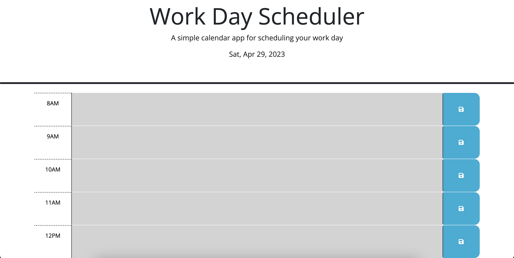

# Calendar App

## Description

This project uses Day.js to create a calendar app that saves events to local storage when the page is refreshed. My goal was to learn how to use Day.js in an application effectively, I built this project to further my knowledge of HTML, CSS, and JavaScript along with server-side API.

## Installation

Follow this link to access the application:
https://jeremiahejensen04.github.io/Calendar_Scheduler/

## Usage

The Calendar color-codes hours relative to the current time.

## License
N/A
